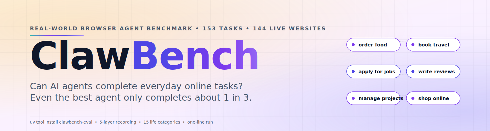

<div align="center">

<a href="https://github.com/reacher-z/ClawBench">
  <picture>
    <source media="(prefers-color-scheme: dark)" srcset="static/hero-dark.svg">
    
  </picture>
</a>

[](https://github.com/reacher-z/ClawBench)
[](https://arxiv.org/abs/2604.08523)
[](https://huggingface.co/papers/2604.08523)
[](https://huggingface.co/datasets/NAIL-Group/ClawBench)
[](https://claw-bench.com)
[](https://github.com/reacher-z/ClawBench)
[](https://discord.gg/clawbench)
[](https://codespaces.new/reacher-z/ClawBench?quickstart=1)

<p align="center"><sub><i>已被收录于</i></sub></p>
<p align="center">
  <a href="https://github.com/walkinglabs/awesome-harness-engineering"></a>
  <a href="https://github.com/Jenqyang/Awesome-AI-Agents"></a>
  <a href="https://github.com/ranpox/awesome-computer-use"></a>
  <a href="https://github.com/ZJU-REAL/Awesome-GUI-Agents"></a>
  <a href="https://github.com/zhangxjohn/LLM-Agent-Benchmark-List"></a>
</p>

<p align="center">
  <a href="https://huggingface.co/papers/2604.08523"></a>
</p>

<p align="center">
  <a href="https://deepwiki.com/reacher-z/ClawBench"></a>
</p>

<p align="center">
  <b>新项目：</b> 欢迎关注我们的姊妹项目 <a href="https://github.com/reacher-z/HarnessBench"><b>HarnessBench</b></a> &mdash;
  固定基础模型，比较不同 Harness。同一套评测流水线，正交维度。
</p>

<a href="#-手动快速开始"></a>

```bash
uv tool install clawbench-eval && clawbench
```

<sub><i>安装 → 运行 → 搞定。&nbsp; 无需 API key。&nbsp; 无需下载数据集。&nbsp; 无需手动配置。</i></sub>

### AI 智能体能完成日常在线任务吗?

**ClawBench 是一个开源基准，用于评测 AI browser agent 在 153 项日常在线任务上的表现 —— 订酒店、点外卖、投简历、管理邮件 —— 涵盖 144 个真实网站。我们用 5 层录制管线加 DOM-match + LLM judge 来衡量端到端任务完成率。目前最高分：33.3%。**

我们让前沿 AI 智能体去做人们每天都在做的事 --<br/>
点外卖、订酒店、投简历、写评价、管理项目。<br/>
**即使最强的模型，也只能完成其中约三分之一。**

<sub><i>由 ZJU-REAL 出品 &nbsp;·&nbsp; 姊妹项目：<a href="https://github.com/reacher-z/HarnessBench">HarnessBench</a> &nbsp;·&nbsp; 任意 Chrome 上即可运行。</i></sub>

---

**153** 个日常任务 &nbsp;&middot;&nbsp; **144** 个真实网站 &nbsp;&middot;&nbsp; **15** 个生活类别

<a href="README.md"> English</a>

</div>

<br/>

<p align="center">
&nbsp;<b>真实网站</b>
&nbsp;&nbsp;&nbsp;&nbsp;&nbsp;&nbsp;
&nbsp;<b>隔离容器</b>
&nbsp;&nbsp;&nbsp;&nbsp;&nbsp;&nbsp;
&nbsp;<b>请求拦截器</b>
&nbsp;&nbsp;&nbsp;&nbsp;&nbsp;&nbsp;
&nbsp;<b>五层录制</b>
</p>

<br/>

## 工作流程

```
   你选择一个任务             ClawBench 启动一个          智能体驱动浏览器:          拦截器捕获所有操作
   来自 153 个真实             隔离的 Docker 容器          导航、填表、点击            并录制完整五层数据
   日常场景                    + Chromium                                           
                                                                                    
   ┌──────────────┐           ┌──────────────┐           ┌──────────────┐           ┌──────────────┐
   │ "在 Rover 上 │    ──►    │    容器      │    ──►    │   AI 智能体  │    ──►    │   五层数据   │
   │  预订宠物    │           │  + Chromium  │           │  浏览真实    │           │   全部拦截   │
   │  寄养"       │           │  + 智能体    │           │   网站       │           │   完整录制   │
   └──────────────┘           └──────────────┘           └──────────────┘           └──────────────┘
```

<br/>

#  LLM 快速开始

将你的编程智能体 (Claude Code, Cursor, Copilot 等) 指向 [`AGENTS.md`](AGENTS.md)，直接提问即可。

<br/>

#  手动快速开始

两条路任选一条 —— 最终都会打开同一个交互式 TUI。

```bash
# 方案 A —— 从 PyPI 安装（推荐大多数用户）
uv tool install clawbench-eval && clawbench
```

```bash
# 方案 B —— 克隆仓库（适合贡献者 / 改代码）
git clone https://github.com/reacher-z/ClawBench.git && cd ClawBench && ./run.sh
```

**前置条件:** [Python 3.11+](https://python.org)、[uv](https://docs.astral.sh/uv/)，以及一个容器引擎 —— [Docker](https://www.docker.com/) **或** [Podman](https://podman.io/)。ClawBench 会自动检测已安装的那个；也可以用 `export CONTAINER_ENGINE=docker` 或 `export CONTAINER_ENGINE=podman` 强制指定。

<details>
<summary><b>安装 Docker 或 Podman</b> (macOS / Linux / Windows)</summary>

#### macOS

```bash
# 方案 A —— Docker Desktop（最简单，带 GUI）
brew install --cask docker
open -a Docker                 # 启动后等任务栏的鲸鱼图标转完

# 方案 B —— Podman（rootless，无 daemon，仅 CLI）
brew install podman
podman machine init            # 一次性：下载 Linux VM 镜像
podman machine start           # 每次 podman 命令前必须先启动
```

> **macOS 上 Podman 需要 VM。** 只 `brew install podman` 是不够的 —— Podman 在 macOS 上靠一个小 Linux VM 来跑容器，装完必须跑一次 `podman machine init && podman machine start`，否则 `podman info` 会直接报 `Cannot connect to Podman`。

#### Linux (Ubuntu / Debian)

```bash
# 方案 A —— Podman（默认 rootless，推荐）
sudo apt update && sudo apt install -y podman

# 方案 B —— Docker
sudo apt install -y docker.io
sudo usermod -aG docker $USER  # 登出再登入让 shell 拾取新组
```

> **Rootful Docker 文件归属坑：** 用 `sudo` 方式跑的 Docker，容器里产生的文件 `docker cp` 出来之后属主是 `root`，普通用户 `rm` 不动。ClawBench 驱动在每次运行后会检测到这个情况，自动 chown `test-output/` 回当前用户。如果你也会用其他容器工具并排跑，可以考虑 rootless Podman（或 rootless Docker）从根上避免这个问题。

#### Windows

```powershell
# 方案 A —— Docker Desktop（WSL2 后端）
winget install Docker.DockerDesktop
# 然后从开始菜单启动 Docker Desktop，等它就绪

# 方案 B —— Podman
winget install RedHat.Podman
podman machine init
podman machine start
```

> 下面那些 `uv run …` 命令请从 **PowerShell**、**WSL2** 或 **Git Bash** 里跑。和 macOS 一样，Windows Podman 第一次用之前也必须 `podman machine init && podman machine start`。

</details>

**1. 配置模型** —— 一次性设置:
```bash
clawbench configure                # 用 $EDITOR 打开 models.yaml
# PurelyMail 凭证（用于注册一次性邮箱）已经随 wheel 一起发布，开箱即用。
# 想用自己的账号，跑 `clawbench configure --secrets` 覆盖即可。
```

> [!NOTE]
> **首次运行会构建容器镜像**（chromium + ffmpeg + noVNC + Node + openclaw，大约 **2 GB** 下载，网速正常大概 **5–10 分钟**）。构建时会实时显示进度 spinner + 当前 step，后续运行直接走 layer 缓存，秒级完成。

**2. 跑你的第一个任务** (三选一):

> [!TIP]
> **推荐 &rarr; 交互式 TUI** &nbsp; 引导式选择模型 + 测试用例
> ```bash
> clawbench
> ```
> 需要交互式终端。管道 / CI / 非 TTY 环境请直接用 `clawbench run` 或 `clawbench batch`。

**(b) 指定模型跑单个任务:**
```bash
clawbench run 001-daily-life-food-uber-eats claude-sonnet-4-6
```
容器启动后,脚本会打印一个 **noVNC URL**（如 `http://localhost:6080/vnc.html`）—— 在浏览器中打开即可实时观看 agent 操作。如果 6080 端口被占用,会自动选一个空闲端口。

结果落在 `./claw-output/<model>/<harness>-<case>-<model>-<timestamp>/`,包含完整的五层录制。默认 harness 是 `openclaw`；想用 [opencode](https://opencode.ai) 就加 `--harness opencode`，想用 [Claude Code](https://docs.anthropic.com/en/docs/claude-code) 就加 `--harness claude-code`（两者均通过 [Playwright MCP](https://github.com/microsoft/playwright-mcp) 驱动浏览器）。

**(c) 通过 noVNC 手动控制浏览器** —— 产出人工参考轨迹:
```bash
clawbench run 001-daily-life-food-uber-eats --human
```
打开脚本打印的 noVNC URL,在浏览器里亲手完成任务,完事后关掉标签页。端口被占时会自动换一个。

<details>
<summary><b>从源码开发</b> &nbsp;— 克隆 + ``./run.sh``（面向贡献者）</summary>

如果你要改 driver、bundled test-cases 或者容器构建本身，用源码 checkout 更合适。

```bash
git clone https://github.com/reacher-z/ClawBench.git && cd ClawBench
cp models/models.example.yaml models/models.yaml   # 编辑：填入你的模型 API 密钥
# `.env`（PurelyMail 凭证，用于一次性邮箱注册）已经随仓库提交，开箱即用。
# 只有想覆盖默认值或添加 HF_TOKEN 时才需要编辑。
./run.sh                                           # 交互式 TUI
uv run claw-bench run \
  test-cases/001-daily-life-food-uber-eats claude-sonnet-4-6   # 单个任务
uv run claw-bench run \
  test-cases/001-daily-life-food-uber-eats --human             # 人工参考
```

这条路径让你在 ``src/clawbench/``、``chrome-extension/``、``test-cases/`` 上实时改代码实时生效 —— 调 harness 本身的时候很顺手。其他场景用上面的 PyPI 安装就够快。

</details>

<br/>

#  ClawBench-Lite

**第一次跑？先跑这个。** [`test-cases/lite.json`](test-cases/lite.json) 是完整 153 任务的 **20 个精选子集**，按站点知名度、真实日常相关度、难度和类别多样性挑选。它对齐了 [browser-use/benchmark](https://github.com/browser-use/benchmark) 的 20-tasks-per-source 规范，用完整 benchmark 一小部分的成本就能拿到可信的信号。

分层: **flagship 9 / core 8 / wildcard 3** —— 覆盖日常生活 (OpenTable, DoorDash, Instacart, TaskRabbit)、娱乐爱好 (Eventbrite, Goodreads, Fandango)、创建初始化 (Asana, Mailchimp, Squarespace)、旅行 (Airbnb)、教育 (LeetCode)、开发技术 (GitHub)、学术研究 (Overleaf)、个人管理 (1Password) 等类别。所有 Lite 任务均由 [`eval/agentic_eval.md`](eval/agentic_eval.md) 判定，不依赖 `url_pattern` 形态。

完整 manifest 格式见 [`test-cases/lite.schema.json`](test-cases/lite.schema.json)；4 轴选择 rubric 与完整 swap history 见 `lite.json` 的 `notes` 字段。

<br/>

#  教程

<div align="center">

<!-- TODO: 替换为实际视频链接 -->

[](https://youtube.com)
&nbsp;&nbsp;
[](https://bilibili.com)

</div>

<br/>

#  演示

<!-- TODO: 替换为实际的演示 GIF/录屏 -->

<table>
<tr>
<td width="50%" align="center">

**在 Uber Eats 上点餐**

https://github.com/user-attachments/assets/placeholder-uber-eats

</td>
<td width="50%" align="center">

**提交求职申请**

https://github.com/user-attachments/assets/placeholder-greenhouse

</td>
</tr>
</table>

> 每次 ClawBench 运行都会产生完整的 MP4 录屏。访问[项目主页](https://claw-bench.com)查看全部 153 个任务的录屏。

<br/>

#  任务走读示例

好奇一个任务从头到尾到底长什么样? 下面是 **001 号任务** 的完整走读。

**任务定义** —— 来自 [`test-cases/001-daily-life-food-uber-eats/task.json`](test-cases/001-daily-life-food-uber-eats/task.json):

```json
{
  "instruction": "On Uber Eats, order delivery: one Pad Thai, deliver to home address, note \"no peanuts\"",
  "time_limit": 30,
  "eval_schema": {
    "url_pattern": "__PLACEHOLDER_WILL_NOT_MATCH__",
    "method": "POST"
  }
}
```

智能体拿到的就是这段原文 `instruction`,另外有只读权限访问 `/my-info/alex_green_personal_info.json` (dummy user 的姓名、住址、电话、生日) 和一个一次性邮箱账号 (万一遇到强制登录)。它有 **30 分钟** 去触发一个 `POST` 请求,超时容器会被 kill。

**智能体要做什么** (顺利路径下):

1. 打开 `ubereats.com`
2. 从 `/my-info/alex_green_personal_info.json` 读出 dummy user 的家庭住址,填入配送地址输入框
3. 在菜品搜索框里搜 **"Pad Thai"**
4. 挑一家能配送到这个地址且有 Pad Thai 的餐厅
5. 进入菜品详情页,在定制或特殊说明字段里填 **"no peanuts"**
6. 加一份到购物车,打开购物车,必要时用一次性邮箱凭据处理登录弹窗
7. 进入 checkout,点 **Place Order**

**拦截器抓到了什么** —— 最后的 *Place Order* 那一点会发起一个 `POST` 请求。ClawBench 的 request interceptor 架在浏览器和目标站之间,**会在请求到达 Uber Eats 服务器之前抓下来**,所以 dummy user 永远不会被真的扣款。拦截发生的那一瞬间,五层录制 (MP4 视频、PNG 截图、HTTP 流量、浏览器动作、智能体消息) 会被一起冻结到 `/data/`。

**裁判怎么判 PASS / FAIL** —— 001 号任务的 `url_pattern` 是特意留的 sentinel `__PLACEHOLDER_WILL_NOT_MATCH__`,这意味着**没有任何请求路径能机械匹配**。判决完全由 [`eval/agentic_eval.md`](eval/agentic_eval.md) 里的 agentic judge 给出 —— 它把智能体的五层录制和人工参考轨迹对照,检查四件事:

- 智能体有没有真正走到最后的 checkout?
- 购物车里是不是**正好一份** Pad Thai (不是两份、也不是套餐)?
- 配送地址是不是 `alex_green_personal_info.json` 里的家庭住址?
- 订单的特殊说明字段里有没有 **"no peanuts"**?

四条全满足才算 **PASS**,任何一条没达到就是 **FAIL**,而且失败证据会被绑定到对应的判据上。正是这种 per-task rubric 让 ClawBench 对裁判敏感而不是对 URL 正则敏感 —— 完整 rubric 格式见 [`eval/README.md`](eval/README.md),judge prompt 见 [`eval/agentic_eval.md`](eval/agentic_eval.md)。

<br/>

#  实验结果

<div align="center">

**6 个前沿 AI 智能体在 ClawBench 上的成功率 (%)**

</div>

| 排名 | 模型 | 总体 | 日常 | 金融 | 工作 | 开发 | 学术 | 旅行 | 社交 | 宠物 |
|:----:|-------|:------:|:-----:|:-----:|:----:|:---:|:----:|:----:|:----:|:----:|
| 1 | **Claude Sonnet 4.6** | **33.3** | 44.2 | **50.0** | 19.0 | 11.1 | **50.0** | 23.1 | **38.9** | **18.2** |
| 2 | GLM-5 | 24.2 | **30.8** | 16.7 | **38.1** | 16.7 | 28.6 | 0.0 | 16.7 | **18.2** |
| 3 | Gemini 3 Flash | 19.0 | 15.4 | 33.3 | 23.8 | **22.2** | 28.6 | **30.8** | 11.1 | 0.0 |
| 4 | Claude Haiku 4.5 | 18.3 | 15.4 | 22.2 | 19.0 | **27.8** | 21.4 | 7.7 | 16.7 | **18.2** |
| 5 | GPT-5.4 | 6.5 | 9.6 | 0.0 | 0.0 | 11.1 | 7.1 | 7.7 | 0.0 | 9.1 |
| 6 | Gemini 3.1 Flash Lite | 3.3 | 1.9 | 0.0 | 0.0 | 5.6 | 14.3 | 0.0 | 0.0 | 9.1 |

<details>
<summary><b>任务类别 (15 个类别, 153 个任务)</b></summary>

| 类别 | 数量 | 示例平台 |
|----------|:-----:|-------------------|
| 日常生活 | 21 | Uber Eats, DoorDash, Instacart, Zillow, Craigslist |
| 娱乐与爱好 | 15 | Ticketmaster, AMC Theatres, Topgolf, Crunchyroll |
| 创建与初始化 | 13 | Squarespace, Wix, Webflow, Ghost, Substack |
| 评分与投票 | 10 | Trustpilot, G2, Goodreads, RateMyProfessors |
| 旅行 | 9 | Booking.com, Expedia, Airbnb, TripAdvisor |
| 教育与学习 | 9 | Coursera, Udemy, Khan Academy, Duolingo |
| 办公与秘书 | 9 | Google Calendar, Slack, Notion, Trello |
| 美容与个护 | 9 | Sephora, Ulta, Glossier |
| 求职与 HR | 8 | LinkedIn, Greenhouse, Lever, Workday |
| 宠物与动物护理 | 8 | Chewy, Petco, Rover |
| 个人管理 | 6 | Mint, YNAB, Todoist |
| 购物与电商 | 6 | Amazon, eBay, Etsy, Target |
| 非营利与慈善 | 6 | GoFundMe, DonorsChoose |
| 学术与研究 | 5 | Google Scholar, Semantic Scholar, OpenReview |
| 金融与投资 | 4 | Robinhood, Fidelity, Coinbase |
| 其他 | 15 | 自动化、开发与技术、政府、家居服务、汽车 |

</details>

<br/>

## ClawBench 与相关工作对比

| Benchmark | 领域 | 环境 | 任务数 | ClawBench 的差异 |
|-----------|------|------|--------|------------------|
| [WebArena](https://webarena.dev) | 合成 Web 应用 | 自建副本 | 812 | 真实消费级网站,而非托管后台 UI |
| [GAIA](https://huggingface.co/datasets/gaia-benchmark/GAIA) | 通用助手 | 闭卷文本 + 工具 | 466 | 以浏览器为中心;端到端任务执行 |
| [SWE-bench](https://www.swebench.com) | 软件工程 | GitHub 仓库 | 2,294 | 非代码;面向日常消费场景 |
| [BrowserGym](https://github.com/ServiceNow/BrowserGym) | Web agent | 无头沙盒 | — | 云端一致;录制真实用户轨迹 |
| [Mind2Web](https://github.com/OSU-NLP-Group/Mind2Web) | Web 导航 | 静态轨迹 | 2,350 | 动态真实站点,不回放录像 |

ClawBench 定位:**真实消费级网站、日常任务、端到端录制**。若你想要受控沙盒或回放轨迹,上面这些项目都很出色。若你想知道你的 agent 今天能不能真的点一份外卖、订一张机票,就用 ClawBench。

<br/>

## 架构

<details>
<summary>容器内部结构</summary>

```
┌─────────────────────────────────────────────────┐
│  容器 (Docker / Podman)                          │
│                                                 │
│  ┌───────────┐   DOM 事件    ┌──────────────┐   │
│  │ content.js├──────────────►│ background.js│   │
│  │ (每个标签)│               │  (service    │   │
│  └───────────┘               │   worker)    │   │
│                              └──┬──────┬────┘   │
│                                 │      │        │
│                            动作 │      │ 截图   │
│                                 │      │        │
│  ┌──────────┐            ┌──────▼──────▼────┐   │
│  │  Xvfb    │◄──ffmpeg──►│  FastAPI Server  │   │
│  │ :99      │  x11grab   │  :7878           │   │
│  └──────────┘            └──────────────────┘   │
│                                  │              │
│  ┌──────────┐            ┌───────▼─────────┐    │
│  │ Chromium │            │     /data       │    │
│  │ :9222 CDP│            │  actions.jsonl  │    │
│  └──────────┘            │  requests.jsonl │    │
│                          │  screenshots/   │    │
│                          │  recording.mp4  │    │
│                          └─────────────────┘    │
└─────────────────────────────────────────────────┘
```

</details>

<br/>

#  命令行

```bash
# 交互式 TUI (推荐):
./run.sh

# 单次运行:
uv run --project test-driver test-driver/run.py test-cases/001-daily-life-food-uber-eats claude-sonnet-4-6

# 人工模式 (通过 noVNC 控制浏览器):
uv run --project test-driver test-driver/run.py test-cases/001-daily-life-food-uber-eats --human

# 批量运行 (所有模型 x 用例 1-50, 3 个并发):
uv run --project test-driver test-driver/batch.py --all-models --case-range 1-50 --max-concurrent 3
```

完整 CLI 文档、批量运行参数、测试用例格式和输出结构详见 [test-driver/README.md](test-driver/README.md)。

<br/>

#  测评

测评是**运行之后**的步骤 -- 先运行智能体收集轨迹,再将轨迹与人类参考运行进行对比评估。

```
 1. 运行智能体 (test-driver)        2. 测评 (eval/)
 ────────────────────────           ────────────────────────────────
 ./run.sh 或 batch.py        ──►    Claude Code 子代理对比
 生成 test-output/                  智能体 vs 人类轨迹
   含五层录制数据                    按 eval/agentic_eval.md rubric 判定
```

测评器将智能体轨迹与人类参考轨迹在五层录制数据（视频、截图、HTTP 流量、浏览器动作、智能体消息）上进行逐步对比,输出 PASS/FAIL 及带证据的判定理由。

完整测评指南和 Claude Code prompt 模板详见 [eval/README.md](eval/README.md)。

<br/>

#  常见问题

<details>
<summary><b>每次运行会产生什么数据?</b></summary>

每次会话会在 `/data/` 下记录五层同步数据:

| 层 | 文件 | 描述 |
|-------|------|-------------|
| 会话回放 | `recording.mp4` | 完整的会话视频 (H.264, 15fps) |
| 动作截图 | `screenshots/*.png` | 每个浏览器动作的带时间戳 PNG |
| 浏览器动作 | `actions.jsonl` | 每个 DOM 事件 (click, keydown, input, pageLoad, scroll 等) |
| HTTP 流量 | `requests.jsonl` | 每个 HTTP 请求,包含 headers、body 和查询参数 |
| 智能体消息 | `agent-messages.jsonl` | 完整的智能体对话记录 (思考、文本、工具调用) |

拦截结果保存在 `interception.json` 中。

</details>

<details>
<summary><b>请求拦截器如何工作?</b></summary>

拦截器会阻止关键的、不可逆的 HTTP 请求 (结账、表单提交、邮件发送) 以防止真实副作用。它通过 CDP 的 `Fetch` 域连接到 Chrome,并将请求与评测 schema (`url_pattern` 正则 + `method` + 可选的 `body`/`params`) 进行匹配。命中时,它会将被阻止的请求保存到 `interception.json`,杀掉智能体并停止录制。

拦截器**不**验证任务完成 -- 评测由独立的评估器在会话结束后处理。

对于在支付墙后的任务 (智能体没有有效的信用卡),评测 schema 使用一个永不匹配的占位模式,因此会话会一直运行到超时。

</details>

<details>
<summary><b>合成用户档案是什么?</b></summary>

每个容器都有一个 `/my-info/` 目录,包含一个虚拟用户身份 (Alex Green): 个人信息 JSON、邮箱凭证和简历 PDF。邮箱是每次运行时新创建的一次性 PurelyMail 地址。智能体在需要填写表单、注册账号等时会读取这些文件。

源模板: `shared/alex_green_personal_info.json` (档案) 和 `test-driver/resume_template.json` (简历)。

</details>

<details>
<summary><b>可以用 Podman 代替 Docker 吗?</b></summary>

可以。设置 `export CONTAINER_ENGINE=podman`。框架会自动检测可用的引擎。Podman 无需 root 权限。

</details>

<details>
<summary><b>智能体可以使用哪些工具?</b></summary>

所有支持的 harness 沙箱限制完全一致：智能体只能使用浏览器工具和一组受限的只读 shell 命令 (`ls`、`cat`、`find`、`grep`、`head`、`tail`、`jq`、`wc` 等)。可能绕过浏览器的命令 (`curl`、`python`、`node`、`wget`) 会被阻止，文件 `edit`/`write` 和 `webfetch` 同样被禁。智能体指令也明确要求只通过浏览器完成任务。

</details>

<details>
<summary><b>如何添加新的测试用例?</b></summary>

参见 [CONTRIBUTING.md](CONTRIBUTING.md)。简言之: 在 `test-cases/` 下创建目录,编写符合 `test-cases/task.schema.json` 的 `task.json`,定义评测 schema,用人工模式测试,然后提交 PR。

</details>

<br/>

## 贡献

我们特别欢迎第一次参与开源的贡献者。如果你平时在网上订过外卖、预约过医生、填过表单,你就已经具备写一个测试用例的能力 —— 大部分 PR 只是单个 JSON 文件,通常一天内合并。

**上手快的几件事:**

- [新增一个测试用例](CONTRIBUTING.md#adding-a-new-test-case)(约 30 分钟,不需要懂容器)
- [新增一个类别](CONTRIBUTING.md#what-were-looking-for) 覆盖 10+ 个任务 &rarr; 获邀成为下一版论文共同作者
- [提交一个新模型](CONTRIBUTING.md#what-were-looking-for) 上公共 leaderboard
- 浏览 [good first issues](https://github.com/reacher-z/ClawBench/labels/good%20first%20issue)

详见 [CONTRIBUTING.md](CONTRIBUTING.md),包含完整流程和贡献者致谢政策。

## 社区

欢迎来和研究者、开发者、贡献者一起讨论真实世界的浏览器 agent。

<table>
<tr>
<td align="center" width="33%">
<a href="docs/community.md#%E5%BE%AE%E4%BF%A1%E7%BE%A4-chinese">

</a>
<br/>
<sub><b>中文社区</b><br/>二维码 + 群规见 docs/community.md</sub>
</td>
<td align="center" width="33%">
<a href="https://discord.gg/clawbench">

</a>
<br/>
<sub><b>English</b><br/>国际研究者和开发者</sub>
</td>
<td align="center" width="33%">
<a href="https://github.com/reacher-z/ClawBench/discussions">

</a>
<br/>
<sub><b>异步问答</b><br/>可搜索 / 长期保存</sub>
</td>
</tr>
</table>

详情(频道划分、群规、微信群加入方式)见 [docs/community.md](docs/community.md)。

## 常见问题

**ClawBench 是什么?**
ClawBench 是一个开源的 AI browser agent 基准 —— 即那些驱动真实浏览器去完成用户任务的系统(基于 GPT、Claude,或开源模型)。它衡量的是 agent 是否真的完成了 153 项日常在线任务,涵盖 144 个真实网站,而不是它产生的文本看起来是否对。

**ClawBench 覆盖哪些任务?**
15 个生活类别:外卖、订票、投简历、购物、租房、邮件与日历管理、学术研究、软件开发、学习平台等等。每一项都是一个普通人在普通的一周里、在真实网站上可能做的事。

**任务成功如何判定?**
每个任务运行在隔离的浏览器容器中,并进行 5 层录制(DOM、网络、截图、动作轨迹、控制台)。一套确定性 DOM 检查覆盖可验证步骤;LLM judge 针对录制结果评判剩余的主观项。分数是 agent 端到端满足的检查项比例。

**目前最高分是多少?**
33.3% —— 大约三分之一的任务完成率 —— 来自我们评测过的最强前沿模型。大多数任务仍能击败我们测试过的每一个模型;提升空间真实存在,基准尚未饱和。

**如何复现已发表的分数?**
`uv tool install clawbench-eval && clawbench` 安装 harness 并启动交互式 TUI,它会从 Hugging Face 下载任务集、构建容器镜像、并在你选择的模型上运行 153 项任务中的任意子集。无需手动准备数据集,也无需把 API key 贴进配置文件。

**在真实网站上运行 ClawBench 安全吗?**
runner 使用加固的容器,内置请求拦截器,默认阻止下单付款、注册账号、发送邮件等不可逆动作。需要*模拟*这些动作的任务(比如"加入购物车并结账")会在最后一个可逆步骤终止。若你的研究确实需要,可以按任务放宽拦截器。

**可以贡献新任务或新 harness 吗?**
可以。任务放在 `src/clawbench/data/test-cases/`,是 YAML 规格 + rubric;详见 `docs/contributing/adding-a-task.md`。Harness(模型与浏览器之间的胶水层)作为 Python entry points 接入 —— harness 侧的脚手架见姊妹项目 [HarnessBench](https://github.com/reacher-z/HarnessBench)。

**ClawBench 和 HarnessBench 是什么关系?**
同一套评分管线,正交维度。ClawBench 固定 harness、比较不同模型;HarnessBench 固定模型、比较不同 harness。两者共享 153 项任务集、5 层录制、和 DOM + LLM judge —— 分数可直接相互比较。

## 引用

如果你在研究中使用了 ClawBench,请引用:

```bibtex
@misc{zhang2026clawbench,
  title         = {ClawBench: Can AI Agents Complete Everyday Online Tasks?},
  author        = {Yuxuan Zhang and Yubo Wang and Yipeng Zhu and Penghui Du and Junwen Miao and Xuan Lu and Wendong Xu and Yunzhuo Hao and Songcheng Cai and Xiaochen Wang and Huaisong Zhang and Xian Wu and Yi Lu and Minyi Lei and Kai Zou and Huifeng Yin and Ping Nie and Liang Chen and Dongfu Jiang and Wenhu Chen and Kelsey R. Allen},
  year          = {2026},
  eprint        = {2604.08523},
  archivePrefix = {arXiv},
  primaryClass  = {cs.AI},
  url           = {https://arxiv.org/abs/2604.08523}
}
```

## 核心贡献者

<table>
<tr>
<td align="center">
<a href="https://github.com/reacher-z">
<br/>
<sub><b>Yuxuan Zhang</b></sub>
</a>
</td>
<td align="center">
<a href="https://github.com/Wyyyb">
<br/>
<sub><b>Yubo Wang</b></sub>
</a>
</td>
<td align="center">
<a href="https://github.com/Perry2004">
<br/>
<sub><b>Perry Zhu</b></sub>
</a>
</td>
<td align="center">
<a href="https://github.com/eternaldolphin">
<br/>
<sub><b>Penghui Du</b></sub>
</a>
</td>
<td align="center">
<a href="https://github.com/MEKSAAA">
<br/>
<sub><b>Junwen Miao</b></sub>
</a>
</td>
</tr>
</table>

## 指导老师

<table>
<tr>
<td align="center">
<a href="https://github.com/k-r-allen">
<br/>
<sub><b>Kelsey R. Allen</b></sub>
</a>
</td>
<td align="center">
<a href="https://github.com/wenhuchen">
<br/>
<sub><b>Wenhu Chen</b></sub>
</a>
</td>
<td align="center">
<a href="https://github.com/jdf-prog">
<br/>
<sub><b>Dongfu Jiang</b></sub>
</a>
</td>
<td align="center">
<a href="https://github.com/chenllliang">
<br/>
<sub><b>Liang Chen</b></sub>
</a>
</td>
</tr>
</table>

## 支持 ClawBench

如果 ClawBench 对你的研究或产品工作有帮助，
最有用的支持就是**[给仓库点一个 Star](https://github.com/reacher-z/ClawBench)** ——
这能让更多 AI agent 研究者发现这个 benchmark，也帮我们持续投入数据集维护。

<p align="center">
<a href="https://github.com/reacher-z/ClawBench">

</a>
</p>

欢迎贡献 —— 新的 test case、bug 修复，或者是我们还没评测过的模型结果提交。参见 [`CONTRIBUTING.md`](CONTRIBUTING.md)。

<p align="center">
<a href="https://github.com/reacher-z/ClawBench/graphs/contributors">

</a>
</p>

## Star 历史

<a href="https://star-history.com/#reacher-z/ClawBench&Date">
  <picture>
    <source media="(prefers-color-scheme: dark)" srcset="https://api.star-history.com/svg?repos=reacher-z/ClawBench&type=Date&theme=dark" />
    <source media="(prefers-color-scheme: light)" srcset="https://api.star-history.com/svg?repos=reacher-z/ClawBench&type=Date" />
    
  </picture>
</a>

## 许可证与致谢

Apache 2.0 -- 详见 [LICENSE](LICENSE)。

基于以下开源项目构建: [OpenClaw](https://github.com/openclaw/openclaw)、[opencode](https://opencode.ai) 和 [Claude Code](https://docs.anthropic.com/en/docs/claude-code)（可选的 harness）, [Microsoft Playwright MCP](https://github.com/microsoft/playwright-mcp)（opencode 和 claude-code harness 的浏览器控制桥）, [LiteLLM](https://github.com/BerriAI/litellm)（claude-code harness 的 API 转换代理）, [noVNC](https://github.com/novnc/noVNC) (MPL 2.0), [websockify](https://github.com/novnc/websockify) (LGPL 3.0)。
